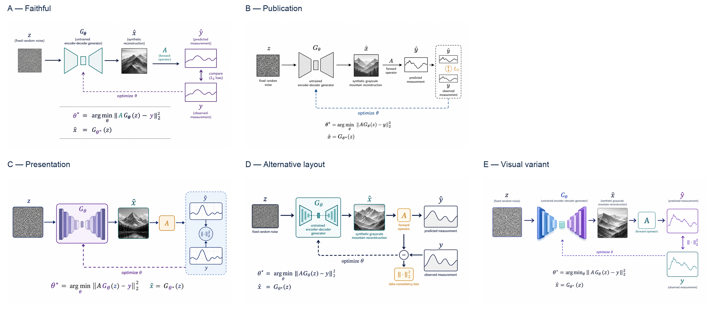
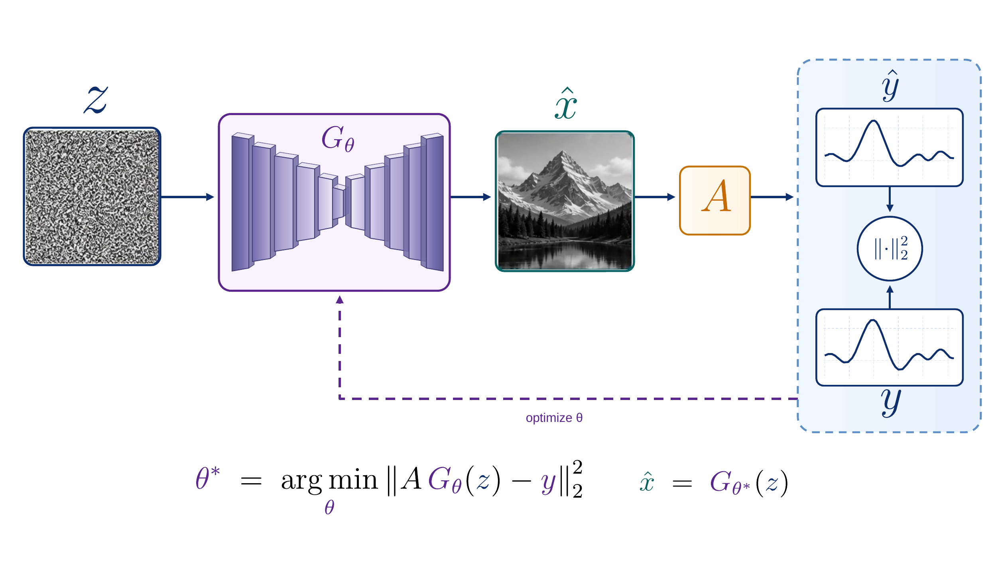

<div align="center">

# Sketch to Scientific Figure

**A Codex workflow that turns a researcher's sketch into five separate visual proposals, then reconstructs an approved direction as editable artifacts.**

[](https://github.com/XinyuanWang283/sketch-to-scientific-figure/actions/workflows/tests.yml)
[](https://www.python.org/)
[](LICENSE)
[](.agents/skills/sketch-to-scientific-figure/SKILL.md)

[Quick start](#quick-start) · [v0.1 reference case](examples/deep_image_prior/reference_case_v0_1.md) · [Support status](#support-status) · [Science Day demo](docs/science-day-demo.md) · [Chinese guide](START_HERE_中文.md)

</div>

Scientific figures are not ordinary image-generation tasks: a polished image can still reverse an arrow, invent an equation, or hide the fact that it is only a flattened bitmap. This repository uses Codex to clarify material ambiguity, generate five distinct visual proposals with built-in ImageGen, preserve the researcher's choice, map that exact candidate into reviewable regions, and rebuild the approved direction as an editable composition. Native vector is the default; a narrowly approved image region remains an explicit, replaceable atom rather than a hidden whole-canvas flattening. In the checked-in example, generator provenance is operator-attested rather than independently proven by repository code.

> **Status:** experimental `v0.1`: a reusable Codex workflow plus one checked-in, structurally verified reference case. It is not a universal converter, human-subject study, benchmark result, or claim of scientific correctness or time saved.

## In 30 seconds

| Input | Codex does | Researcher decides | Output |
|---|---|---|---|
| A hand-drawn sketch plus exact labels, equations, or method notes | Asks only outcome-changing questions, then makes five separate built-in ImageGen calls | Corrects ambiguity, approves one exact rendered candidate or requests a new revision, approves its region map, and makes the final scientific decisions | Five PNG proposals, then case-specific editable SVG/PPTX, an experimental structural draw.io view, and a PDF export/preview |

**AI proposes; the scientist decides.** Clarification is a short conversation, not a structured-interpretation form. The researcher never has to approve JSON before seeing a useful picture. Built-in ImageGen proposes five visual directions; the researcher chooses or requests changes; post-selection code reconstructs native objects and checks programmable structure.

```text
sketch → focused clarification → five separate ImageGen calls
       → approve one exact candidate / request a newly rendered revision
       → hash-bound selection → approved region map → editable reconstruction
       → automated structural checks → separate researcher decisions
```

The **live Codex path** uses built-in ImageGen when that capability is available in the current Codex environment. It does not require a repository-managed or user-supplied `OPENAI_API_KEY`. Repository Python records and validates artifacts; it does not pretend to call Codex's built-in image tool.

The **offline reference path** replays frozen, hash-bound evidence. It does not rerun ImageGen. This is the stable primary path for Science Day and the only v0.1 case whose reconstruction and artifact structure have been verified here.

## Quick start

From a clean checkout, use Python 3.11 or newer. The commands below were verified on macOS and Linux; Windows has not yet been verified. Installation may download declared dependencies; the replay itself is local and offline. The output directory must be outside the repository and must not already exist.

```bash
git clone https://github.com/XinyuanWang283/sketch-to-scientific-figure.git
cd sketch-to-scientific-figure
python3 --version  # must report Python 3.11 or newer
python3 -m venv /tmp/sketch-figure-v01-venv
source /tmp/sketch-figure-v01-venv/bin/activate
python -m pip install -r requirements.txt
python scripts/replay_reference_case.py replay \
  --output-dir /tmp/sketch-figure-reference-v0-1
python scripts/replay_reference_case.py validate \
  --run-dir /tmp/sketch-figure-reference-v0-1
python scripts/replay_reference_case.py status \
  --run-dir /tmp/sketch-figure-reference-v0-1
```

If the default `python3` is older, replace it consistently with an installed supported interpreter such as `python3.11`.

The replay copies the frozen reference package into `/tmp/sketch-figure-reference-v0-1`, verifies the five recorded candidate events and Candidate C selection, consumes the approved region map, recomputes structural evidence, registers the exact delivery, and imports its hash-bound visual approval. Expected stage: `VISUAL_APPROVED`. Its governance fields remain `PENDING` because replay preserves the pre-authorization snapshot; the annotated `v0.1.0` tag separately records the owner's scientific-content, Science Day-use, and public-release approvals for the exact release tree.

This v0.1 repository is an executable Codex workflow, not an importable Python library or an installed console application. The dependency command above intentionally installs only the declared runtime packages and does not create `*.egg-info` in the checkout.

Inspect these first:

- `/tmp/sketch-figure-reference-v0-1/reference_case_v0_1_readiness.json` — integrity and approval status;
- `/tmp/sketch-figure-reference-v0-1/START_HERE.md` — explains the replay-level visual approval versus package-internal null fields;
- `/tmp/sketch-figure-reference-v0-1/imagegen_workflow_state.json` — append-only workflow state;
- `/tmp/sketch-figure-reference-v0-1/delivery/svg/master.svg` — editable mixed-vector SVG;
- `/tmp/sketch-figure-reference-v0-1/delivery/pptx/figure.pptx` — editable PowerPoint objects;
- `/tmp/sketch-figure-reference-v0-1/delivery/drawio/figure.drawio` — experimental structural graph;
- `/tmp/sketch-figure-reference-v0-1/delivery/pdf/publication.pdf` — one-page preview/export.

To rebuild the case-specific delivery without touching the frozen canonical directory, first run the native-runtime preflight in [runtime requirements](docs/runtime_requirements.md). The rebuild is optional; the frozen replay above is the portable default.

```bash
python scripts/build_deep_image_prior_c_fidelity_v2.py \
  --soffice "$SOFFICE_BIN" \
  --pdftoppm "$PDFTOPPM_BIN" \
  --output-dir /tmp/sketch-figure-fidelity-v2-rebuild-01
```

This rebuild depends on the documented local native tools and does not inherit the frozen visual approval.

### Optional live Codex path

Open the repository in a Codex session with built-in image generation available, attach a sketch, and invoke:

```text
$sketch-to-scientific-figure
```

Codex asks only material clarification questions, then makes five separate calls for slots A–E. The five outputs are separate original files; a labeled comparison sheet may be assembled afterward. A live result remains blocked until the researcher explicitly approves one exact selection and the case-specific region map. Availability and pixels may vary by Codex environment.

For a 3–5 minute narrated walkthrough, full-runtime command, fallback path, and recovery notes, use the [Science Day demo guide](docs/science-day-demo.md).

## What you get

- A repository-scoped Codex skill that turns ambiguity into a short conversation instead of a user-facing JSON contract.
- Exactly five active built-in ImageGen candidate slots with fixed A–E roles, initially populated by five separate generation calls.
- Hash-bound candidate registration and explicit researcher approval of one exact candidate without pretending that Python invoked ImageGen. A revision or combination request must first become a newly rendered candidate in a new proposal run.
- Hash-bound post-selection region mapping, followed by semantic reconstruction with stable IDs, live labels, equation metadata, explicit ports, and source/target connectors.
- Independent adapters for SVG, Figma-ready SVG, PowerPoint, draw.io, and PDF exports.
- Structural validation and regression tests that remain separate from scientific approval.

## A real five-candidate example

The [Deep Image Prior example](examples/deep_image_prior/README.md) uses an original hand-drawn synthetic sketch that was not copied or traced from a paper figure. Five separate Codex built-in ImageGen calls produced five genuinely different visual directions from the same clarified scientific relationships.

[](examples/deep_image_prior/README.md)

The researcher ultimately approved **candidate C alone** as the visual reference. Compact history capsules preserve earlier rejected attempts without making them part of the active path. The current review package records eight Candidate C regions, then rebuilds the figure with two exact, replaceable image atoms and native/vector scientific structure.

[](examples/deep_image_prior/editable_delivery_c_fidelity_v2/README.md)

The canonical [fidelity-v2 package](examples/deep_image_prior/editable_delivery_c_fidelity_v2/README.md) preserves the selected noise and synthetic mountain regions as exactly two unresampled, replaceable raster atoms referenced through relative SVG sidecars. Network layers, frames, plots, connectors, labels, and nine aspect-preserving LaTeX-derived equations remain native or vector objects in SVG/PPTX. The image atoms are not pixel-editable or scientific evidence. The draw.io file is an experimental structural view: the official CLI currently renders major colored regions as black blocks and equations as raw LaTeX, so it is not visual-fidelity evidence. Structural checks pass, and the frozen case records a separate human visual approval bound to the artifact-manifest hash. Its checked-in governance fields preserve the pre-authorization snapshot state; the annotated `v0.1.0` tag records project-owner approval for scientific content, Science Day use, and public release of that exact tree.

## Developer checks

```bash
git clone https://github.com/XinyuanWang283/sketch-to-scientific-figure.git
cd sketch-to-scientific-figure
python3 --version  # must report Python 3.11 or newer
python3 -m venv /tmp/sketch-figure-dev-venv-01
source /tmp/sketch-figure-dev-venv-01/bin/activate
python -m pip install -r requirements.txt
python -m unittest discover -s tests -v
```

The optional Deep Image Prior fidelity-v2 rebuild additionally needs Node.js with the local artifact-tool module, LaTeX/dvisvgm, LibreOffice, and Poppler. See [runtime requirements](docs/runtime_requirements.md).

## How the default workflow works

```text
hand-drawn sketch + prior conversation
                    │
          focused clarification
                    │
          short rendering brief
                    │
 five separate built-in ImageGen calls
        A       B       C       D       E
                    │
 researcher approves one exact candidate
       or requests a new rendered revision
                    │
        explicit candidate approval
                    │
 internal reconstruction metadata + master.svg
          │          │          │          │
         SVG       PPTX      draw.io      PDF
                    │
          structural validation
                    │
          final researcher check
```

A candidate image is never scientific authority. It may influence composition, hierarchy, palette, whitespace, or glyph treatment. Exact text, equations, labels, counts, topology, IDs, and connector endpoints are rebuilt from the sketch and the researcher's clarification. Internal semantic metadata is allowed after selection, but the researcher is not required to author or approve it before seeing candidates.

## Responsibility boundary

| Layer | Responsible for | Explicitly not responsible for |
|---|---|---|
| Codex clarification | Identifies material ambiguity and produces a short prose rendering brief | Requiring the researcher to review a hidden structured interpretation |
| Built-in ImageGen | Five proposals from separate generation calls | Scientific authority, editable source, or candidate approval |
| Reconstruction code | File/hash bindings, native objects, exports, and repeatable checks after selection | Judging whether a scientific claim is correct |
| Programmable validation | XML/OOXML/PDF structure, IDs, relations, text/vector evidence, and report status | Scientific correctness, visual quality, or final approval |
| Researcher/operator | Corrects ambiguity, approves an exact rendered candidate or requests a new one, approves reconstruction, and makes the final decision | Delegating accountability to an AI image or validator status |

## Support status

The frozen Deep Image Prior v0.1 reference case is validated and replayed by `scripts/replay_reference_case.py`. The status labels below describe programmable structural evidence for that exact hash-bound package, not scientific correctness, visual quality, or application-level manual review.

| Deliverable | Report status | Editability boundary |
|---|---|---|
| Canonical semantic source and SVG | `VERIFIED` | Stable semantic objects, live text, connectors, and equation metadata are checked |
| PowerPoint (`.pptx`) | `VERIFIED` | Native shapes, live text, connector references, and equation objects with authoritative LaTeX provenance are inspected; an export may use editable fallback text or rendered SVG equations, but not native Office Math |
| draw.io (`.drawio`) | `STRUCTURAL_ONLY` for fidelity v2 | Native `mxCell` objects and source/target edges are checked. The fidelity-v2 official CLI render has black major regions and raw-LaTeX equations, so visual fidelity is not verified |
| Figma-ready SVG | `IMPORT_READY_UNVERIFIED` | SVG structure is checked, but an actual Figma import has not been verified |
| Publication PDF | `VERIFIED` | The canonical one-page PDF parses and renders as an export/preview; `semantic_editability=false`, so it is not an editable source |

Any failed required structural or integrity check blocks validation and replay.

## Why not stop at generated pixels?

| Generated visual direction | Semantic scientific figure |
|---|---|
| Useful for composition and style exploration | Authoritative for exact content and topology |
| May hallucinate text, formulas, or arrows | Uses live text and exact equation metadata |
| Usually flattened | Keeps groups, connectors, IDs, and style tokens editable |
| Hard to regression-test | Supports schema, hash, geometry, and relation checks |
| Requires visual judgment | Still requires visual judgment **and** scientific sign-off |

## Researcher control points

1. **Clarification:** answer only questions whose answers materially change the science or visual result. This is not an approval gate.
2. **Candidate decision:** approve one exact candidate, reject the set, or request a revision or combination. Any requested change must first be rendered and registered as a new candidate; editable reconstruction never starts from an unrendered composite instruction.
3. **Final check:** review exact labels, equations, arrow directions, native objects, and target-application appearance before using the figure.

Automated checks support these decisions. They do not make them.

## Repository map

- [`.agents/skills/`](.agents/skills/sketch-to-scientific-figure/SKILL.md) — repository-scoped Codex skill and execution order.
- [`examples/deep_image_prior/`](examples/deep_image_prior/README.md) — original hand sketch, five separately generated ImageGen candidates, preserved decision history, an eight-region reconstruction map, and the canonical fidelity-v2 case with frozen pre-authorization state plus tag-level owner approvals.
- [`prompts/`](prompts/) — focused clarification, five-candidate generation, review, and reconstruction instructions.
- [`rules/`](rules/) and [`schemas/`](schemas/) — stable rule IDs and machine-readable contracts.
- [`scripts/imagegen_workflow.py`](scripts/imagegen_workflow.py) — local evidence ledger for five active candidate slots, explicit selection and region-map approval, validation-gated delivery registration, and separate approvals; it never invokes ImageGen.
- [`scripts/`](scripts/) — comparison-sheet builder, compilers, renderers, adapters, orchestration, and validators.
- [`tests/`](tests/) — deterministic pass/fail fixtures and workflow regression tests.
- [`docs/science-day-demo.md`](docs/science-day-demo.md) — a 3–5 minute demo centered on the frozen offline replay, with an optional live ImageGen extension.
- [`docs/technical_reference.md`](docs/technical_reference.md) — full artifact and workflow reference.
- [`ASSETS.md`](ASSETS.md) — provenance and reuse boundaries for the public sketch, candidates, crops, and derived outputs.

## Evidence and safety boundary

- Generated pixels are not evidence, measured data, ground truth, or a scientific result.
- Registered candidate provenance is operator-attested and not independently generator-verified by this repository.
- Source files and candidate originals can be hash-bound; repository records cannot independently prove the backend model identity.
- Whole-canvas raster images are forbidden in the canonical SVG by default.
- The default live path uses Codex built-in ImageGen and does not request a user-supplied OpenAI API key. Repository Python never calls the Image API.
- A passing validator is not scientific validation, a quality guarantee, or a substitute for researcher review.
- Figma import is unverified; PDF outputs are exports/previews and are not semantically editable.
- Optional native-runtime rebuild availability and adapter output can vary by local tool versions.
- No output should be called publication-ready or production-ready until a researcher has reviewed it in its target application and context.
- Time saving is a hypothesis until active human time is measured across comparable cases.

## Contributing and citation

Small, reviewable contributions are welcome. Read [CONTRIBUTING.md](CONTRIBUTING.md), especially the privacy and evidence rules, before opening a pull request. Citation metadata is available in [CITATION.cff](CITATION.cff).

If the workflow is useful to your research or teaching, consider starring the repository so other researchers can find it.

## License

Released under the [MIT License](LICENSE).
