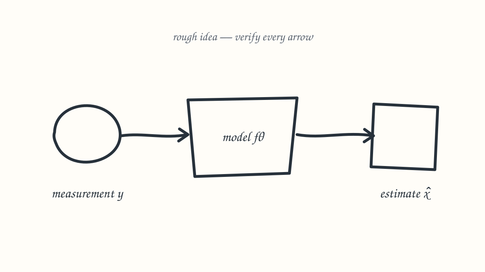
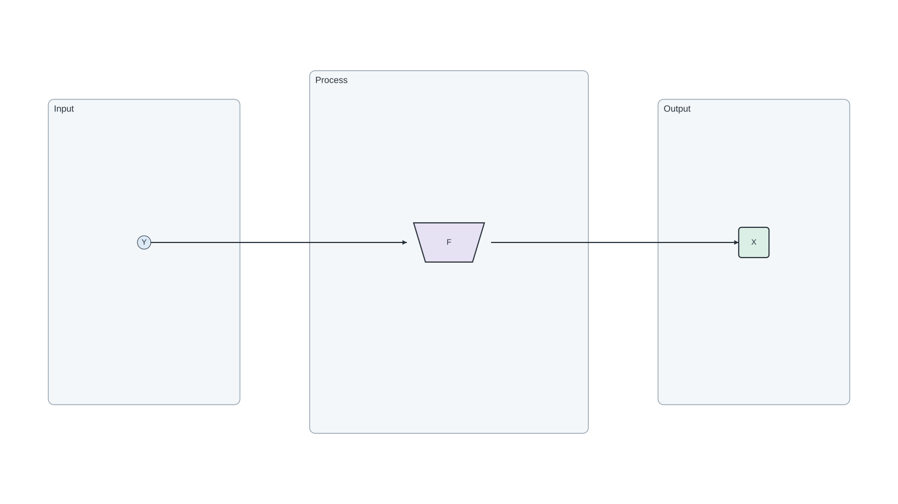

<div align="center">

# Sketch to Scientific Figure

**Turn a rough method sketch into a reviewable, editable scientific figure while keeping scientific truth under researcher control.**

[](https://github.com/XinyuanWang283/sketch-to-scientific-figure/actions/workflows/tests.yml)
[](https://www.python.org/)
[](LICENSE)
[](.agents/skills/sketch-to-scientific-figure/SKILL.md)

[Quick start](#quick-start) · [Safe example](#a-complete-safe-example) · [How it works](#how-it-works) · [中文入口](START_HERE_中文.md)

</div>



Scientific figures are not ordinary image-generation tasks. A polished picture can still contain a reversed arrow, invented equation, wrong count, or uneditable text. This repository separates visual exploration from scientific authority and reconstructs the accepted direction as semantic vector objects.

> **Status:** experimental `v0.1`. The repository includes a fictional, non-confidential example. It does not claim a measured time-saving percentage or replace scientific review.

## What you get

- A repository-scoped Codex skill for guided or direct figure development.
- Machine-readable scientific truth, provenance hashes, layout blueprints, and validation rules.
- Deterministic SVG/PNG topology skeletons before any visual generation.
- A three-gate workflow that keeps the researcher in charge of story, visual direction, and final delivery.
- A canonical semantic source with stable IDs, live labels, equation metadata, explicit ports, and source/target connectors.
- Independent adapters for SVG, Figma-ready SVG, PowerPoint, draw.io, and PDF.
- Regression tests for both valid and deliberately broken semantic figures.

## A complete safe example

The included example is fictional: a measurement `y` enters one abstract model `f_θ` and produces an estimate `x̂`. It contains no experimental data, performance result, or unpublished method.

| Rough sketch | Deterministic topology | Editable semantic SVG |
|---|---|---|
|  |  |  |

Inspect the full [synthetic restoration example](examples/synthetic_restoration/README.md), including its source hashes, truth contract, blueprint, compiled prompt, semantic validation spec, and reproducible commands.

## Quick start

### Use it as a Codex skill

1. Clone the repository and open it as a Codex workspace.
2. Attach a hand-drawn sketch and the authoritative method text/equations.
3. Invoke:

```text
$sketch-to-scientific-figure
```

Use `INTAKE_MODE: guided` when you want the visual brief developed one high-impact question at a time. Use `INTAKE_MODE: direct` when the scientific and visual constraints are already explicit.

### Run the deterministic checks locally

```bash
git clone https://github.com/XinyuanWang283/sketch-to-scientific-figure.git
cd sketch-to-scientific-figure
python3 -m venv .venv
source .venv/bin/activate
python -m pip install -e .
python -m unittest discover -s tests -v
```

Rebuild and validate the safe example:

```bash
python scripts/compile_figure_artifacts.py --run-dir examples/synthetic_restoration
python scripts/render_topology_skeleton.py \
  --truth examples/synthetic_restoration/truth/scientific_truth.json \
  --blueprint examples/synthetic_restoration/blueprints/synthetic_restoration.json \
  --output-dir examples/synthetic_restoration/skeletons
python scripts/validate_figure_artifacts.py \
  --run-dir examples/synthetic_restoration \
  --source-root .
python scripts/validate_semantic_svg.py \
  --svg examples/synthetic_restoration/editable_figure.svg \
  --spec examples/synthetic_restoration/validation_spec.json
```

The full multi-format adapter pipeline additionally uses Node.js, TeX, LibreOffice, Poppler, and the Codex bundled presentation runtime. See [runtime requirements](docs/runtime_requirements.md).

## How it works

```text
sketch + authoritative method text/equations
                    │
                    ▼
     scientific_truth.json + source hashes
                    │
                    ▼
        layout blueprint + topology skeleton
                    │
           Gate 1: story / wireframe
                    │
                    ▼
         bounded visual-direction candidates
                    │
           Gate 2: human selection
                    │
                    ▼
 semantic_figure.json + equations.tex + master.svg
          │          │          │          │
         SVG       PPTX      draw.io      PDF
                    │
           executable validation
                    │
           Gate 3: final sign-off
```

The generated image is never scientific authority. It may influence composition, hierarchy, palette, whitespace, or glyph treatment. Exact text, equations, counts, topology, IDs, and connector endpoints come from the approved contract and are rebuilt deterministically.

## Why not stop at generated pixels?

| Generated visual direction | Semantic scientific figure |
|---|---|
| Useful for composition and style exploration | Authoritative for exact content and topology |
| May hallucinate text, formulas, or arrows | Uses live text and exact equation metadata |
| Usually flattened | Keeps groups, connectors, IDs, and style tokens editable |
| Hard to regression-test | Supports schema, hash, geometry, and relation checks |
| Requires visual judgment | Still requires visual judgment **and** scientific sign-off |

## Three human gates

1. **Story and wireframe:** approve what the figure says and the macro-layout that says it.
2. **Visual direction:** select a scientifically safe composition and palette; generated text remains non-authoritative.
3. **Final delivery:** review final-size and grayscale previews, formulas, SVG checks, and cross-format outputs.

Automated checks support these decisions. They do not make them.

## Repository map

- [`.agents/skills/`](.agents/skills/sketch-to-scientific-figure/SKILL.md) — repository-scoped Codex skill and execution order.
- [`examples/synthetic_restoration/`](examples/synthetic_restoration/README.md) — fictional end-to-end example safe to share.
- [`prompts/`](prompts/) — scientific brief, proposal, review, and reconstruction instructions.
- [`rules/`](rules/) and [`schemas/`](schemas/) — stable rule IDs and machine-readable contracts.
- [`scripts/`](scripts/) — compilers, renderers, adapters, orchestration, and validators.
- [`tests/`](tests/) — deterministic pass/fail fixtures and workflow regression tests.
- [`docs/technical_reference.md`](docs/technical_reference.md) — full artifact and workflow reference.

## Evidence and safety boundary

- Generated pixels are not evidence, measured data, ground truth, or a scientific result.
- Source files are hashed; non-native assets require provenance and replacement status.
- Whole-canvas raster images are forbidden in the canonical SVG by default.
- No OpenAI API key, hosted service, database, OCR pipeline, or tracing service is required by the repository.
- A passing validator is not a substitute for researcher review.
- Time saving is a hypothesis until active human time is measured across comparable cases.

## Contributing and citation

Small, reviewable contributions are welcome. Read [CONTRIBUTING.md](CONTRIBUTING.md), especially the privacy and evidence rules, before opening a pull request. Citation metadata is available in [CITATION.cff](CITATION.cff).

If the workflow is useful to your research or teaching, consider starring the repository so other researchers can find it.

## License

Released under the [MIT License](LICENSE).
