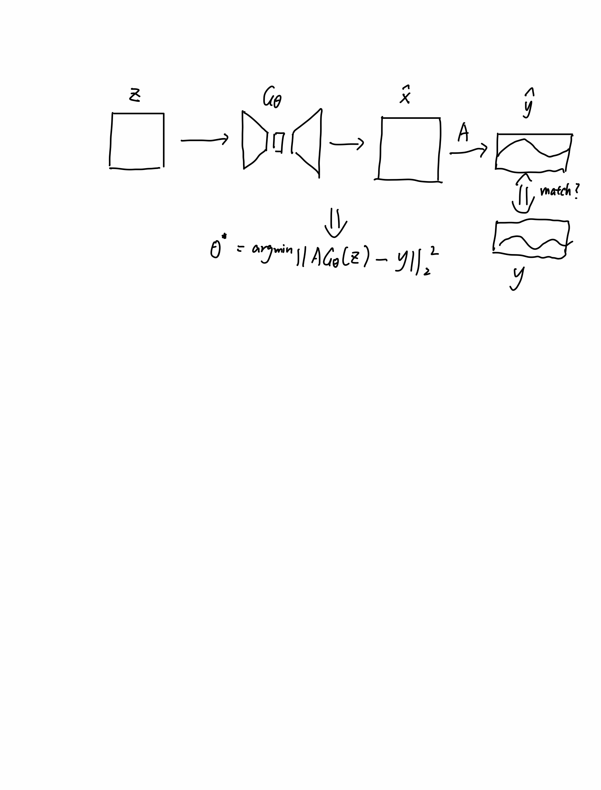
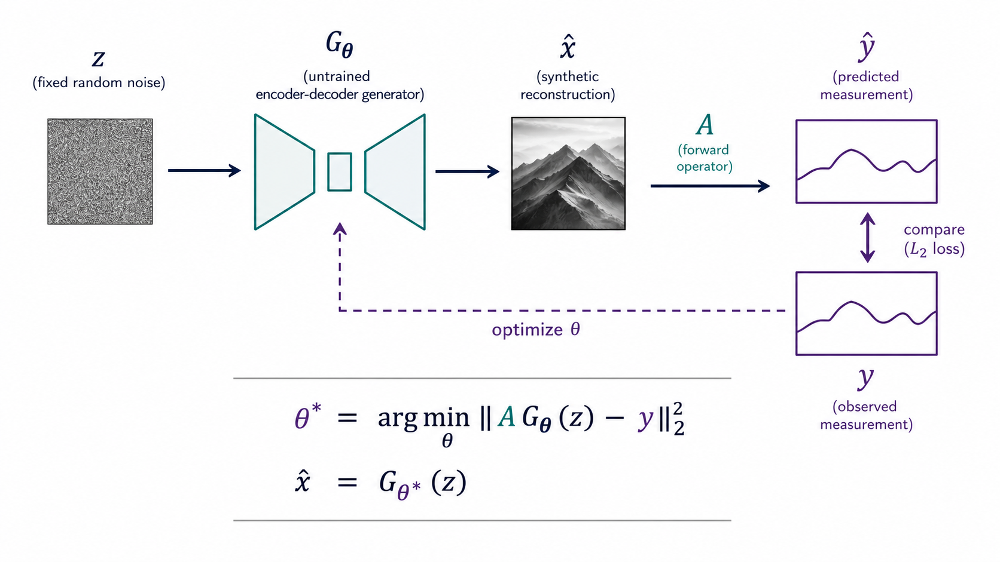
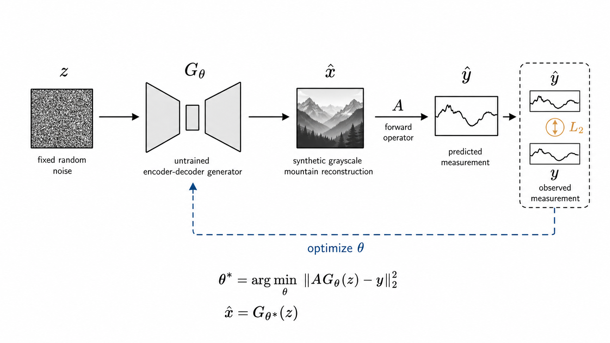
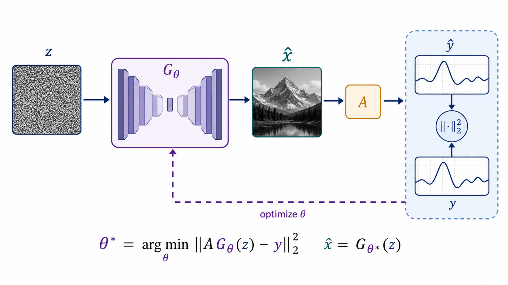
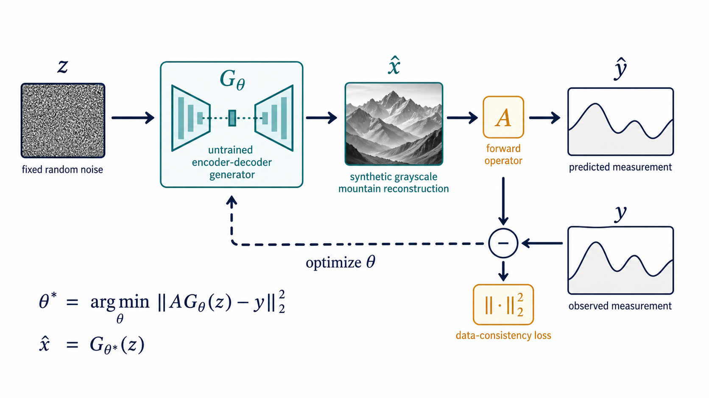
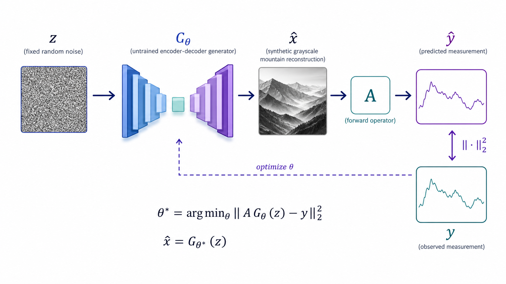

# Deep Image Prior: five ImageGen candidates and an editable delivery

This publication-safe example starts from an original hand-drawn schematic of the Deep Image Prior principle. It is not copied or traced from a paper figure and contains no experimental data or unpublished method.

Method concept attribution: Dmitry Ulyanov, Andrea Vedaldi, and Victor Lempitsky, [*Deep Image Prior*](https://arxiv.org/abs/1711.10925), CVPR 2018. This repository example is an independently drawn explanatory schematic, not a reproduction of the paper's figure artwork.

The example demonstrates the new front-door workflow:

> sketch → focused clarification → five separate Codex ImageGen calls → researcher selection or revision → explicit approvals → case-specific editable reconstruction

## Input sketch

The compact human-readable [`clarification_brief.md`](clarification_brief.md) records the scientific invariants inferred from the sketch and conversation. It is not a structured-interpretation approval form.

## Five candidates from separate calls

The comparison sheet was assembled locally after the five originals existed; it is not a sixth ImageGen output.

| A — Faithful | B — Publication |
|---|---|
|  |  |

| C — Presentation | D — Alternative layout |
|---|---|
|  |  |

| E — Visual variant |
|---|
|  |

Each candidate used the same sketch and scientific invariants but a different art-direction suffix. See [`generation_prompts.md`](generation_prompts.md) and [`candidate_manifest.json`](candidate_manifest.json) for the direction summaries, file hashes, dimensions, and five mandatory repository-local `generation_event_id` values. No native tool-call ID is recorded because the tool exposed none for this frozen evidence. The recorded events and observed embedded Content Credentials are provenance evidence, not cryptographic proof of backend identity or call isolation by repository code.

## Researcher decision history and current editable result

The first reconstruction used this hash-bound instruction:

> Use D's layout with C's visual style

After reviewing that delivery, the researcher rejected its visual result and asked to try **candidate C alone**. The first native-only C reconstruction was also rejected because it no longer retained enough of candidate C's visual quality. A later hybrid preserved the two image regions but stretched the LaTeX objects and had not instantiated the repository's full region-map stage. The active decision in [`candidate_selection_c_only.json`](candidate_selection_c_only.json) still binds the exact C source file; the current implementation now starts from an eight-region map.

The canonical [fidelity-v2 delivery](editable_delivery_c_fidelity_v2/README.md) binds eight visible regions to the selected PNG hash and records an inspection overlay. A separate [`raster_atom_review_decision.json`](editable_delivery_c_fidelity_v2/source/raster_atom_review_decision.json) authorizes only the noise and synthetic mountain content as exact-pixel, replaceable review-draft atoms. Frames, network layers, plots, arrows, labels, and nine aspect-preserving LaTeX-derived equations remain native or vector objects in SVG/PPTX. The v0.1 [reference-case record](reference_case_v0_1.md) binds structural evidence and a separate visual approval to exact hashes; scientific approval, Science Day use, and public release remain pending.

The [all-native region-first option](editable_delivery_c_region_native/README.md), earlier [region-fidelity draft](editable_delivery_c_region_fidelity/README.md), [hybrid](editable_delivery_c_hybrid/README.md), [native-only C delivery](editable_delivery_c/README.md), and [D-layout/C-style delivery](editable_delivery/README.md) are preserved as legacy decision evidence without being overwritten. They are not current alternatives to the canonical fidelity-v2 pointer. [`selection_history.json`](selection_history.json) records the revision sequence.

[`candidate_selection.template.json`](candidate_selection.template.json) remains a blank reusable template. It supports either one exact candidate or a hash-bound layout/style combination; automated checks never populate approval.

## Editability boundary

The five PNGs remain flattened visual proposals. The active Candidate C direction uses an explicit region-first mixed-media boundary:

- `source/selected_candidate_map.json` binds eight source regions to Candidate C's SHA-256 before reconstruction;
- exactly two unresampled, replaceable raster atoms retain the selected noise and synthetic mountain appearance;
- SVG and PowerPoint keep the frames, network layers, plots, arrows, labels, and equations as native/vector objects;
- LaTeX is authoritative for all nine equation objects;
- draw.io is an experimental topology-editing view rather than the high-fidelity visual master; the official CLI currently renders major colored regions as black blocks and the nine equations as raw LaTeX;
- PDF is an export/preview, not an editable source.

Candidate C is not embedded as a whole-canvas image. The two image atoms are replaceable but not pixel-editable and are explicitly classified as synthetic, non-evidentiary visuals. Automated checks confirm the candidate hash, eight-region map, exact crop hashes, two-raster boundary, nine vector equations, seven directed connectors, formula aspect ratios, file parsing, and portable provenance records. They cannot establish scientific correctness or create final researcher approval.

This is region-level fidelity, not pixel equivalence. Fidelity v2 uses editable gradient generator layers and local reference-fitted synthetic curves, but neither operation recovers scientific data from Candidate C. Diagnostic image metrics and triptychs support human review; they do not create visual, scientific, or publication approval.

See the [v0.1 reference-case note](reference_case_v0_1.md) for the live Codex path, offline frozen replay, format boundaries, and pending approvals.

## Asset and provenance note

The sketch was created by the repository author. The five candidate PNGs were produced with Codex built-in ImageGen and retain their embedded Content Credentials; the repository has not cryptographically validated those credentials. The comparison sheet is a local derivative assembled from the five originals and has no standalone Content Credentials. The repository-level [`LICENSE`](../../LICENSE) is the only license statement supplied here; no separate third-party asset license or scientific-use guarantee is asserted.
