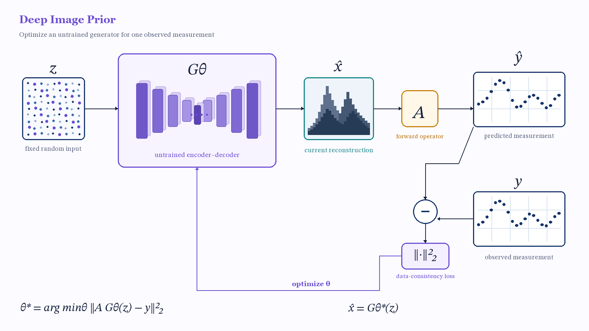

# Historical reconstruction: D layout + C visual style

**Review outcome:** `REJECTED_FOR_VISUAL_REVISION`.

This compact capsule preserves the visible result of the first hash-bound direction, “Use D's layout with C's visual style.” The decision is recorded in [`../candidate_selection.json`](../candidate_selection.json), and its place in the append-only sequence is recorded in [`../selection_history.json`](../selection_history.json).

The full historical package is preserved in the immutable [`v0.1.0` tag](https://github.com/XinyuanWang283/sketch-to-scientific-figure/tree/v0.1.0/examples/deep_image_prior/editable_delivery). It is intentionally omitted from current `main`; this preview is not the active result or evidence of scientific approval. Use the canonical [`editable_delivery_c_fidelity_v2/`](../editable_delivery_c_fidelity_v2/README.md) package for the verified reference case.
