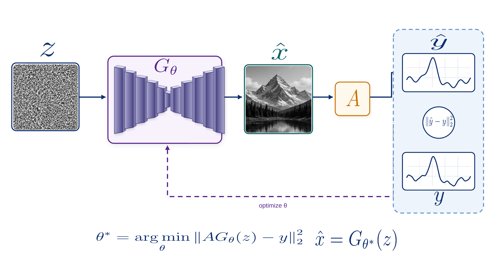

# Candidate C high-fidelity hybrid review draft

This revision responds to the researcher's visual review of the earlier all-vector candidate-C reconstruction. It keeps candidate C as the sole approved visual reference, preserves its dense noise texture and synthetic mountain image, and rebuilds the scientific structure around them as editable/vector objects.



**Review status:** `VERIFIED_HYBRID_REVIEW_DRAFT`. The package has passed programmable file, topology, raster-boundary, and formula-provenance checks. It has **not** received final scientific or visual approval.

## Why this is a hybrid

The earlier reconstruction made every visible element native, but the stylized noise and mountain regions no longer looked close enough to candidate C. This revision therefore uses exactly two bounded, replaceable raster atoms cropped from the selected candidate:

1. the synthetic noise texture;
2. the synthetic mountain reconstruction visual.

There is no whole-canvas screenshot. Frames, the encoder-decoder layers, plots, arrows, labels, the loss node, and the feedback path are rebuilt as native or vector objects. The two raster atoms are synthetic visual modules, not measured data or scientific results.

## Formula policy

[`source/equations.tex`](source/equations.tex) is the authoritative formula source. All nine displayed equations were rendered locally from LaTeX into path-only SVG objects; no formula is a screenshot and no ordinary-text approximation is used.

For wording or symbol changes, edit the LaTeX source and regenerate the package. The equation objects in SVG and PowerPoint can be moved, resized, or recolored, but their mathematical content should be changed through the `.tex` source so every format stays consistent.

The optimization objective used here is:

```tex
\theta^{\ast}=\operatorname*{arg\,min}_{\theta}
\left\lVert A G_{\theta}(z)-y\right\rVert_{2}^{2}
```

The central comparison node explicitly shows `\lVert\hat{y}-y\rVert_{2}^{2}` rather than an ambiguous norm placeholder.

## Files and editability

| Artifact | Role | Verified editability boundary |
|---|---|---|
| [`source/hybrid_figure.json`](source/hybrid_figure.json) | Canonical geometry, topology, styling, and formula references | Structured source |
| [`source/equations.tex`](source/equations.tex) | Authoritative LaTeX for all nine equation objects | Edit and regenerate |
| [`source/assets/`](source/assets/) | Two approved synthetic raster atoms | Replaceable/croppable modules; internal pixels are not vector-editable |
| [`delivery/svg/master.svg`](delivery/svg/master.svg) | High-fidelity hybrid visual master | Major structure and modules editable; exactly two embedded PNG atoms |
| [`delivery/pptx/figure.pptx`](delivery/pptx/figure.pptx) | One-slide presentation version | Native frames, network layers, plots, labels, connectors, arrowheads, and vector equations; two replaceable raster pictures |
| [`delivery/drawio/figure.drawio`](delivery/drawio/figure.drawio) | Topology-focused editing view | Native nodes and seven directed edges; intentionally not the high-fidelity visual master |
| [`delivery/pdf/publication.pdf`](delivery/pdf/publication.pdf) | Mixed-media publication preview/export | No semantic-editability claim |
| [`validation/hybrid_validation_report.json`](validation/hybrid_validation_report.json) | Portable machine-readable checks | File structure only; not scientific validation |

PowerPoint contains nine tiny transparent PNG compatibility fallbacks paired with nine SVG equation objects. The fallbacks contain no rendered formula content; the substantive raster count remains exactly two.

## Preserved decision history

The source candidate remains hash-bound by [`../candidate_selection_c_only.json`](../candidate_selection_c_only.json). The previous native-only C reconstruction remains unchanged in [`../editable_delivery_c/`](../editable_delivery_c/README.md), and the earlier D-layout/C-style reconstruction remains unchanged in [`../editable_delivery/`](../editable_delivery/README.md). [`../selection_history.json`](../selection_history.json) records why each revision was superseded.

## Rebuild

Install the Python package and the full native-adapter runtime described in the [runtime requirements](../../../docs/runtime_requirements.md). The advanced rebuild additionally needs `latex`, `dvisvgm`, LibreOffice, Poppler, and a Node module path containing `@oai/artifact-tool`:

```bash
RUNTIME_NODE=/absolute/path/to/node \
RUNTIME_NODE_MODULES=/absolute/path/to/node_modules \
python scripts/build_deep_image_prior_c_hybrid.py \
  --output-dir /tmp/deep-image-prior-c-hybrid-01
```

The output directory must not already exist. The builder refuses to overwrite an existing package.

Automated validation does not establish scientific correctness, visual acceptance, or permission to publish. **Final researcher approval remains pending.**
