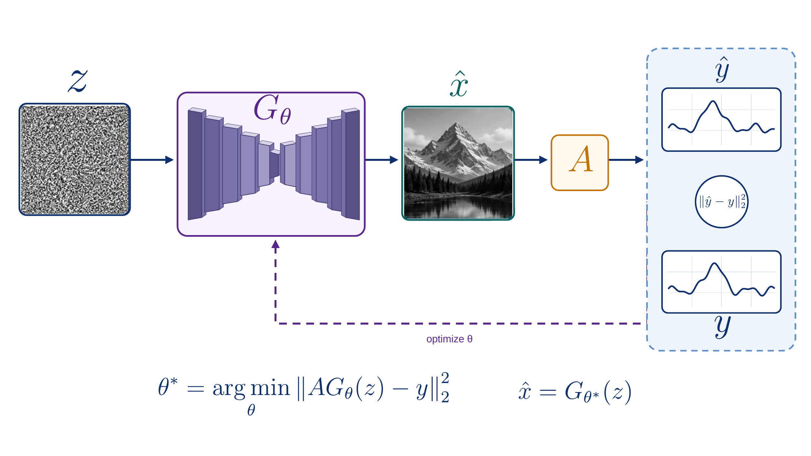

# Historical reconstruction: Candidate C region-first fidelity

**Review outcome:** `SUPERSEDED_BY_VERIFIED_FIDELITY_V2_REFERENCE`.

This compact capsule preserves the visible result of the first eight-region fidelity reconstruction. It established the two-atom mixed-media boundary but preceded the validator and manifest hardening recorded by fidelity v2. The exact selection remains in [`../candidate_selection_c_only.json`](../candidate_selection_c_only.json), with the full sequence in [`../selection_history.json`](../selection_history.json).

The full historical package is preserved in the immutable [`v0.1.0` tag](https://github.com/XinyuanWang283/sketch-to-scientific-figure/tree/v0.1.0/examples/deep_image_prior/editable_delivery_c_region_fidelity). It is intentionally omitted from current `main`; this preview is not the active result or evidence of scientific approval. Use the canonical [`editable_delivery_c_fidelity_v2/`](../editable_delivery_c_fidelity_v2/README.md) package for the verified reference case.
